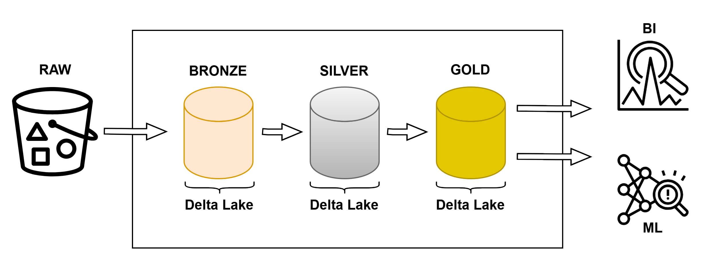

# Project Overview: Marketing Analytics Pipeline

## Dataset Description

This project uses the **Marketing Analytics Dataset**, which contains information about marketing campaigns and customer interactions. Key columns in the dataset include:

- **Campaign_ID**: Unique identifier for each marketing campaign.
- **Company**: Name of the company running the campaign.
- **Campaign_Type**: Type of campaign (e.g., Email, Display, Influencer).
- **Channel_Used**: Channel through which the campaign is delivered (e.g., Google Ads, YouTube).
- **Conversion_Rate**: Conversion rate for each campaign.
- **Acquisition_Cost**: Cost to acquire customers in each campaign.
- **Clicks**: Number of clicks per campaign.
- **Impressions**: Number of times the campaign was viewed.
- **Location**: Target location for the campaign.
- **Target_Audience**: Age group targeted by the campaign.

These features are essential for analyzing customer behavior, assessing campaign effectiveness, and driving actionable insights.

Link to dataset: [Campaign Marketing Performance Analysis](https://www.kaggle.com/code/dinachanthan/campaign-marketing-performance-analysis?select=marketing_campaign_dataset.csv)

## Project Objectives

The project builds a **data engineering pipeline** that processes marketing data into an optimized format for business analytics using a **Medallion architecture**. This architecture includes four layers:

1. **RAW Layer**: Holds the original dataset.
2. **BRONZE Layer**: Copies RAW data in a more accessible format, Delta Lake.
3. **SILVER Layer**: Cleans and enriches data, adding calculated fields (e.g., engagement rates and age groups).
4. **GOLD Layer**: Implements dimensional modeling with **fact and dimension tables**. This layer enables detailed business analysis by structuring data in a star schema format.

 

## Target Outcomes

This project aims to:
- Provide clean, reliable, and well-modeled data for analysis by data analysts or for model development by data scientists.
- Offer marketing insights into customer behavior, campaign performance, and channel effectiveness.
- Enable scalability and easy integration of new data sources.
- Demonstrate industry-standard data engineering practices with **Databricks** and **AWS**.

The GitHub repository includes organized notebooks that document each pipeline stage.

## Pipeline Overview

### BRONZE Layer
- **Notebook**: `01_BRONZE_Data_Ingestion`
  - Reads and copies RAW data to BRONZE catalog using Delta Lake.

### SILVER Layer
- **Notebook**: `02_SILVER_Data_Cleaning_Enrichment`
  - Cleans and enriches data by:
    - Removing missing or inconsistent values.
    - Standardizing data types.
    - Adding fields such as age groups and campaign efficiency scores.

### GOLD Layer
- **Notebook**: `03_GOLD_Data_Aggregation_Modeling`
  - Aggregates data and creates a **dimensional model** with fact and dimension tables:
    - **Fact Table** (`fact_campaign_performance`): Contains numerical metrics (e.g., Clicks, Impressions).
    - **Dimension Tables** (`dim_company`, `dim_campaign`, `dim_channel`, `dim_location`): Hold descriptive information, connected via surrogate IDs for optimized joins.
  - Outputs data ready for BI tools.

## File Structure

- **docs**
  - `architecture.md`: Overview of the Medallion architecture.
  - `data_flow.md`: Data flow through RAW, BRONZE, SILVER, and GOLD layers.
  - `databricks.md`: Information about Databricks platform.
  - `setup_aws.md`: AWS resources for Databricks setup.
- **notebooks**
  - `01_BRONZE_Data_Ingestion.ipynb`
  - `02_SILVER_Data_Cleaning_Enrichment.ipynb`
  - `03_GOLD_Data_Aggregation_Modeling.ipynb`
- **resources**
  - `imgs`: Contains architectural diagrams and images.
  - `raw_data`: Contains the initial dataset.
