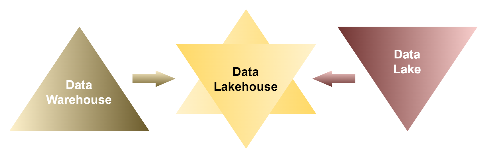
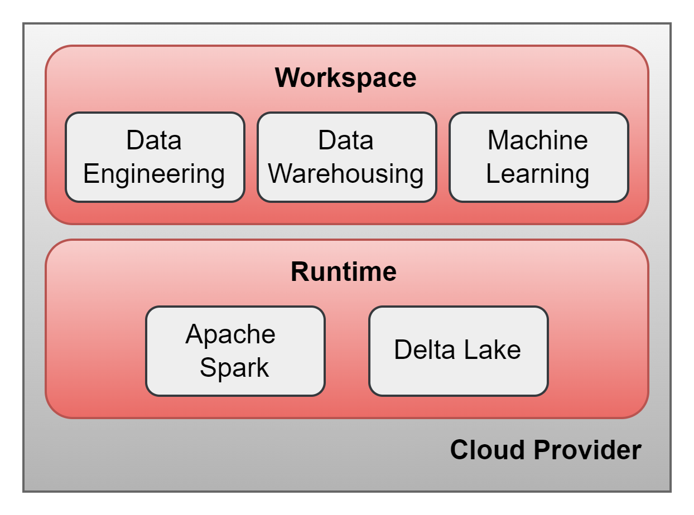
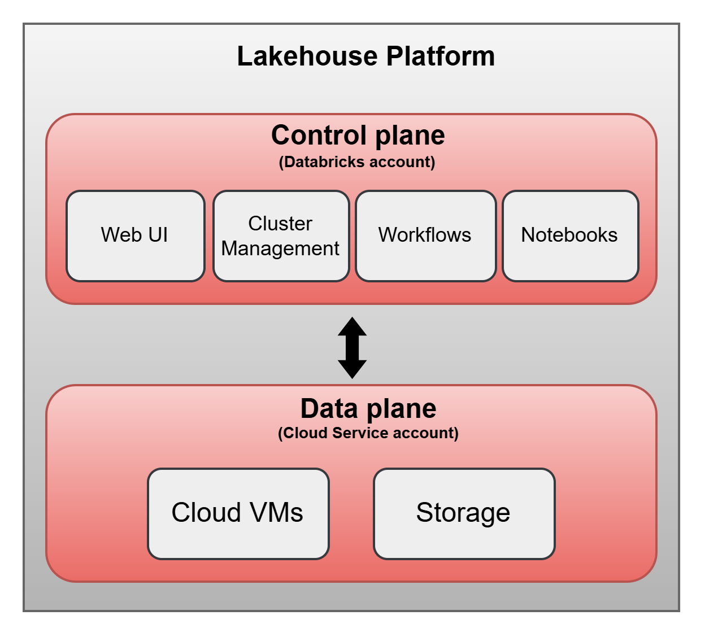
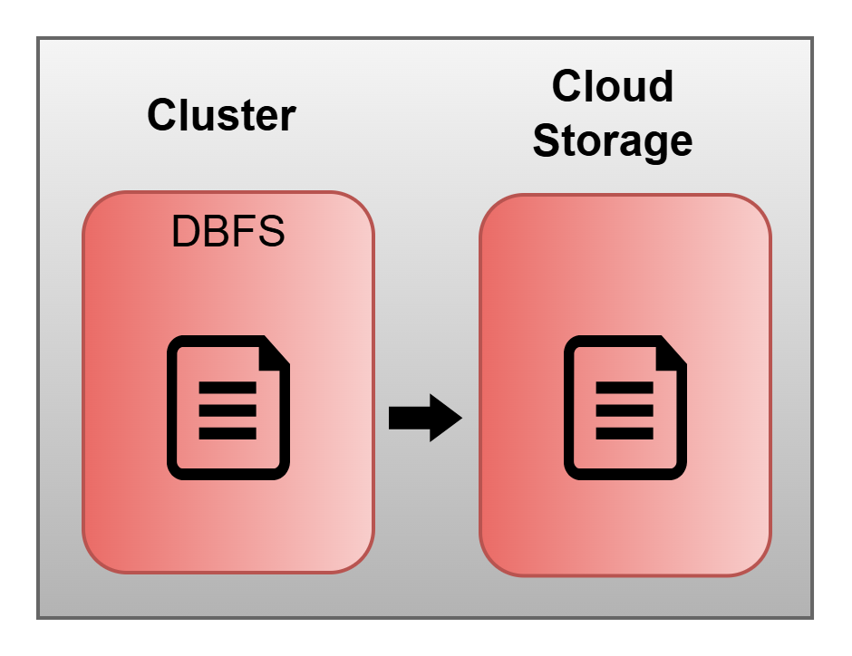

# Lakehouse Platform

--- 

## What is Databricks?

 - A multi-cloud lakehouse platform based on Apache Spark.

## What is Lakehouse?

 - A unified analytics platform that combines the best elements of data lakes and data warehouses:
    - Openness, flexibility, and ML support of data lakes.
    - Reliability, strong governance, and performance of data warehouses.
 - In a lakehouse, you work with data engineering, analytics, and AI all in one platform.

 

*A good reference for understanding Lakehouse:* https://docs.databricks.com/en/lakehouse/index.html / https://www.databricks.com/br/glossary/data-warehouse

## How is a Lakehouse Divided?

 - 3 different levels:
    1. Cloud Service: Available on Azure, AWS, and GCP. Databricks uses the infrastructure of the cloud provider to provision 
    virtual machines or nodes of a cluster, pre-installed with Databricks Runtime (Apache Spark, Delta Lake, etc.).
    2. Runtime: (Apache Spark, Delta Lake).
    3. Workspace: Allows you to interactively implement and run your data engineering, analytics, and AI workloads.

 

 *A good reference for understanding the Layers of Lakehouse:* https://www.databricks.com/discover/data-lakes

## Interaction Between Databricks and Cloud Provider

 - Control Plane (on Databricks): Provides the tools you need to use and control your infrastructure.
 - Data Plane (on cloud provider): Cluster VMs and Storage (DBFS), ensuring compute and storage are always in your cloud account.

 

## Spark on Databricks

 - In-memory, distributed data processing.
 - Supports all languages: Scala, Python, SQL, R, and Java.
 - Capable of batch processing and stream processing.
 - Handles structured, semi-structured, and unstructured data (e.g., images, videos).

## Databricks File System (DBFS)

 - Pre-installed in Databricks clusters.
 - Acts as an abstraction layer: data is persisted to the underlying cloud storage.
 - Files created in the cluster and stored in DBFS are actually persisted in the underlying cloud storage (e.g., Azure Storage (ADLS) 
 containers or S3 buckets). Data remains safe even after the cluster is terminated.

  