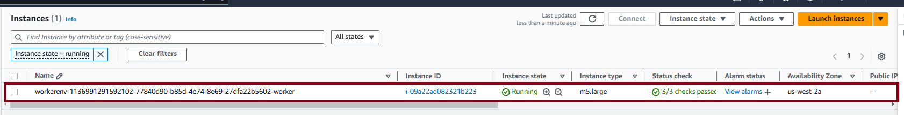
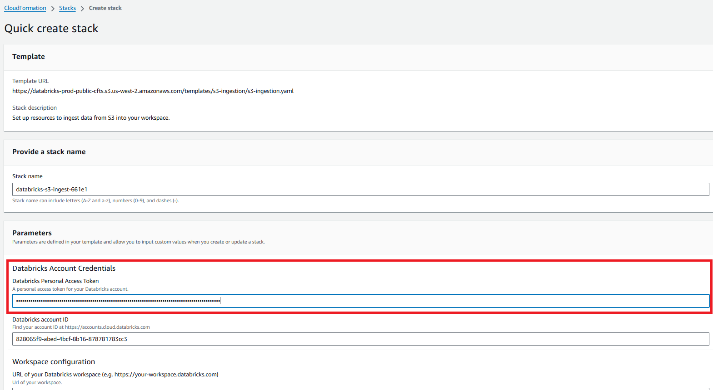
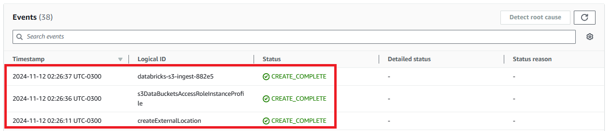
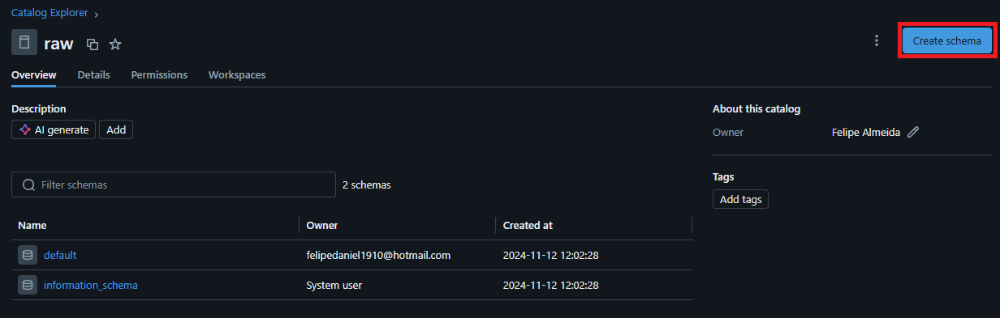
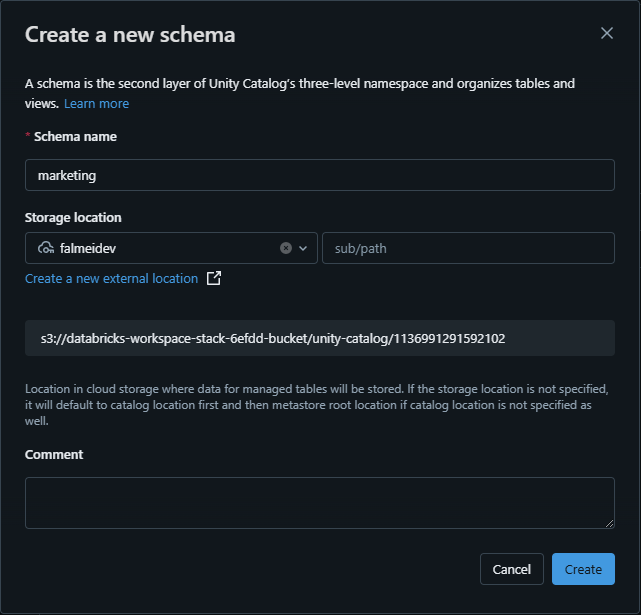
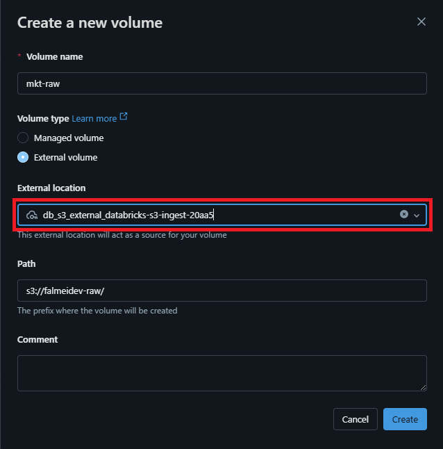
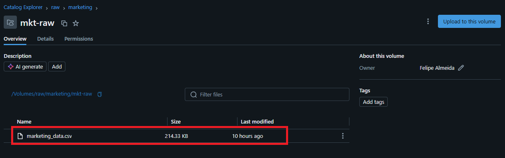

# Step-by-Step Implementation of the Marketing Analytics Pipeline

This document outlines the detailed steps for implementing the marketing analytics pipeline using Databricks and AWS, following a Medallion Architecture approach. Each section covers the tasks involved in transforming raw data into structured insights through multiple layers (RAW, BRONZE, SILVER, and GOLD).

## 1. Setting Up the Databricks Workspace

- **Step 1.1**: Create a new Databricks workspace on AWS.

    - In the Databricks Account Console, click on "Create Workspace".

    

    - You can choose the Quick Start to quickly configure your workspace or do it manually. In our case, we will choose the first option.

    

    - It is necessary to give a name to the new workspace and also select the region desired. In our case, the name will be "falmeidev", and the region "us-west-2".

    

    - After that, you will be redirected to AWS, where the dependencies to Databricks will be created (S3 access, credentials configuration and so on). In the AWS page, you just need to flag the Aknoledge and then click in "Create stack", on the right bottom.

    

    - At this time, AWS will start the configuration needed by Databricks workspace. It might take some minutes. When finished, you can refresh your page of the Databricks Account Console and the new workspace will appear there. To have access to the new workspace, just click in "open". 

     

- **Step 1.2**: Create a new cluster and select the appropriate instance types for the project.

    - To process the data, it is necessary to create a cluster. To do it on Databricks, it is necessary to click in "Compute", then "All-purpose compute" (because we want to create a cluster with general purpose) and finally "Create compute".  

     

    - We will configure a basic cluster with the specifications below.

     

    - The creation may take some minutes, and after that you will see your cluster available.

     

    - If we go to the EC2 instances on AWS, we will see the new compute create on Databricks running in there.

     

## 2. Ingesting Data into the RAW Layer

- **Step 2.1**: Upload the raw `marketing_data.csv` file to a designated location in S3.

    - If you access the S3 on you AWs account, you will see that with the creation of the Databricks workspace, it were create also 2 new bucket automatically, that is where the data of the Unity Catalog will be persisted. 

     

    - In a real world scenario, the data ingested on S3, using diferent tools, will be stored on diferent buckets, so to simulate a real world case, we will create another bucket to store the csv file with the raw_data. To create it, we jus need to click in " Create bucket", then give a name for our bucket (in our case, "falmeidev-raw"), and click in "Create bucket". 

     

    - Now, our new bucket will appear with the other two.

     

    - To open the bucket, it is only necessary to click on its name. Once we are inside the bucket, we can upload a file. So, clicking in "Upload", we will insert the "marketing_data.csv" into S3.

     

    - After this process, the csv file will be already stored on our S3 bucket and ready to be reached by Databricks. 

     

- **Step 2.2**: Create an external location in Databricks pointing to the S3 bucket.

    - When the Databricks workspace is created, we saw that 2 buckets are created automatically, and AWS configure that Databricks can freely access and manage the data inside these 2 buckets. With the creation of another bucket "falmeidev-raw" to store the raw data, we are dealing with a bucket that databricks doesnt have access. To solve this, we need to go on Databricks and create a "External Location", that will configure the permissions to Databricks reach the files in a external bucket. To create a external location, we need to go to the Databricks, click in "catalog", then click in the "+" icon e finally click in "Add an external location".

      

     - We can select the Quickstart option and click "Next".

      

     - In the next page, we need to write the bucket name that we wnat Databricks to access and generate a token. *Obs.: This token needs to be copied to use in the next page*. Click in "Launch in Quickstart".

      

    - An AWS page will open, and it is necessary to paste the Token in the section showed in the image below, and also check the acknoledge in the bottom of the page and finally click in "Create stack".

     

    - The process to create the external location might take some minutes, and after that, will appear the events of the completion.

     

- **Step 2.3**: Create a catalog RAW in Databricks.
    
    - With the External Location configured, it is possible to create our RAW catalog and store the Data Inside it. Lets create the catalog RAW on databricks, and inside this catalog we create the Schema "marketing", and then inside this Schema we can create a volumns pointing to the external location. To create the catalog, on Databricks we need to click in "Catalog", then in the "+" icon and finally in "Add a catalog". 

     

    - In the new window, we need to give a name for the catalog ("raw" in this case) and in "Storage location" select the current workspace location "falmeidev". Then, we can click on create.

     

- **Step 2.4**: Create a Schema in Databricks.
    
    - Inside the new catalog, we will create the Schema "marketing". To do this, it is necessary to click on the catalog "raw" and then click on "Create schema".

     

    - Configure the new schema like that:

     

- **Step 2.5**: Create a Volumn in Databricks.
    
    - Inside the schema, we need to create a volumn, that will be named as "mkt-raw" and in "Storage location" select the external location created ("db_s3_external_databricks..."). Then, we can click on create.

     

     

    - Note that after this, inside the volumn created, the csv file will appear. This way we can access the file data througt Databricks. 

     

## 3. Storing Raw Data in the BRONZE Layer

- **Step 3.1**: Create the BRONZE catalog and the "marketing" schema.

    - To create the new catalog for the BRONZE layer and also the Schema inside the catalog, the are are the same showed above in the **steps 2.3** and **2.4**. As a result we have the structure below.

     

- **Step 3.2**: Load the raw data from the external location into the **BRONZE** table in Delta format.

    - Using the notebook "01_BRONZE_Data_Ingestion", we read the csv file and then create a DELTA Table on the BRONZE layer. Using the SQL notebook, we have the following codes.

    ```
    %sql
    -- Create temporary view
    CREATE OR REPLACE TEMPORARY VIEW mkt_raw
    USING csv
    OPTIONS (
    path '/Volumes/raw/marketing/mkt-raw',
    header 'true',        -- Define the first row as header
    inferSchema 'true'    -- Infer the schema automamtically
    );
    ```

    ```
    %sql
    -- Show the data 
    SELECT * FROM mkt_raw
    ```

    ```
    %sql
    -- Create the DELTA table on the BRONZE layer
    CREATE OR REPLACE TABLE bronze.marketing.marketing_data
    USING delta 
    AS
    SELECT 
    *
    FROM mkt_raw;
    ```
## 4. Enriching Data in the SILVER Layer

- **Step 4.1**: Create the SILVER catalog and the "marketing" schema.

    - To create the new catalog for the SILVER layer and also the Schema inside the catalog, the are are the same showed above in the **steps 2.3** and **2.4**. As a result we have the structure below.

     

- **Step 4.2**: Perform data cleaning and enrich the data.

    - We created some new feature based on the available columns (enrichment of data) and also cleaned by removing NULL values in Conversion_Rate and Acquisition_Cost. The code used to this is the one that follows. The complete notebook is available in "notebooks/02_SILVER_Data_Cleaning_Enrichment".

    ```
    %sql
    CREATE OR REPLACE TEMPORARY VIEW cleaned_enriched_marketing_data AS
    SELECT DISTINCT  -- Remove duplicates
        Campaign_ID,
        UPPER(TRIM(Company)) AS Company,  -- Normalize company name
        UPPER(TRIM(Campaign_Type)) AS Campaign_Type,  -- Normalize campaign type
        Target_Audience,
        Duration,
        UPPER(TRIM(Channel_Used)) AS Channel_Used,  -- Normalize used channel
        CASE 
            WHEN Conversion_Rate >= 0 AND Conversion_Rate <= 1 THEN Conversion_Rate
            ELSE NULL
        END AS Conversion_Rate,  -- Remove outliers and invalid conversion rate values
        CAST(REPLACE(Acquisition_Cost, '$', '') AS DECIMAL(10, 2)) AS Acquisition_Cost,  -- Remove symbols and convert cost
        CASE 
            WHEN ROI >= 0 THEN ROI
            ELSE NULL
        END AS ROI,  -- Remove invalid ROI values
        UPPER(TRIM(Location)) AS Location,  -- Normalize location
        Language,
        
        -- Replace null values with zero in Clicks and Impressions, as these are count metrics
        COALESCE(Clicks, 0) AS Clicks,
        COALESCE(Impressions, 0) AS Impressions,
        Engagement_Score,
        Customer_Segment,
        
        -- Convert and standardize date format
        CAST(Date AS DATE) AS Date,

        -- Enrichment: Campaign Efficiency Classification
        CASE 
            WHEN ROI >= 7 THEN 'High'
            WHEN ROI BETWEEN 4 AND 6.99 THEN 'Medium'
            ELSE 'Low'
        END AS Campaign_Efficiency,

        -- Enrichment: Calculate Cost Per Click (CPC)
        CASE 
            WHEN Clicks > 0 THEN CAST(REPLACE(Acquisition_Cost, '$', '') AS DECIMAL(10, 2)) / Clicks
            ELSE NULL
        END AS CPC,

        -- Enrichment: Calculate Engagement Rate
        CASE 
            WHEN Impressions > 0 THEN Clicks / CAST(Impressions AS FLOAT)
            ELSE NULL
        END AS Engagement_Rate,

        -- Enrichment: Age Group Classification
        CASE 
            WHEN Target_Audience LIKE '%18-24%' THEN '18-24'
            WHEN Target_Audience LIKE '%25-34%' THEN '25-34'
            WHEN Target_Audience LIKE '%35-44%' THEN '35-44'
            WHEN Target_Audience LIKE '%45-54%' THEN '45-54'
            ELSE 'Others'
        END AS Age_Group

    FROM mkt_bronze
    WHERE Conversion_Rate IS NOT NULL  -- Remove records with null conversion rate
    AND Acquisition_Cost IS NOT NULL  -- Remove records with null acquisition cost
    AND Date IS NOT NULL;  -- Ensure there is a valid date

    ```


- **Step 4.3**: Save the enriched data into the **SILVER** Delta table.

    - The following code was used to save the enriched data into the SILVER layer.

    ```
    %sql
    CREATE OR REPLACE TABLE silver.marketing.marketing_data AS

    SELECT 
    *
    FROM cleaned_enriched_marketing_data
    ```

## 5. Aggregating Data for the GOLD Layer

- **Step 5.1**: Create the GOLD catalog and the "marketing" schema.

    - To create the new catalog for the GOLD layer and also the Schema inside the catalog, the are are the same showed above in the **steps 2.3** and **2.4**. As a result we have the structure below.

     

- **Step 5.2**: model the data (dimensional model).

    - In the dimensional model, we will create:

        - Fact Table: Contains numerical data that can be aggregated, such as Clicks, Impressions, Conversion_Rate, etc.
        - Dimension Tables: Contains descriptive information, such as Company, Campaign_Type, Target_Audience, Location, among others.
    
    - Based on the data provided, we will create a fact table fact_campaign_performance and several dimension tables,   such as dim_company, dim_campaign, dim_channel, and dim_location.

    - The code used to build these tables is available on the notebook "03_GOLD_Data_Aggregation_Modeling". After the modeling, the data is organized as showed below.

     

- **Step 5.3**: Store the aggregated data in the **GOLD** tables, optimized for reporting.

    *(Provide SQL or PySpark aggregation queries for summarizing data)*

## 6. Finalizing the Pipeline and Testing

- **Step 6.1**: Test the full pipeline to ensure all layers are working as expected.
- **Step 6.2**: Validate that the data in the **GOLD** layer is ready for use in business analytics.
- **Step 6.3**: Schedule regular updates for the pipeline to process new incoming data.

    *(Include screenshots of successful pipeline execution and test results)*

---

## Conclusion

This document walks through each step required to implement the marketing analytics pipeline, from data ingestion through to the final aggregation for reporting. By following these steps, the marketing team will have easy access to well-organized data for decision-making.
