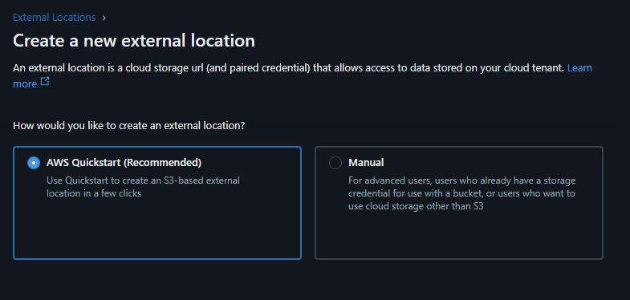

# Step-by-Step Implementation of the Marketing Analytics Pipeline

This document outlines the detailed steps for implementing the marketing analytics pipeline using Databricks and AWS, following a Medallion Architecture approach. Each section covers the tasks involved in transforming raw data into structured insights through multiple layers (RAW, BRONZE, SILVER, and GOLD).

## 1. Setting Up the Databricks Workspace

- **Step 1.1**: Create a new Databricks workspace on AWS.
  - In the Databricks Account Console, click on "Create Workspace".

    

  - Choose the Quick Start configuration or set it up manually. Here, we select Quick Start.

    

  - Provide a name for the workspace, "falmeidev", and select region "us-west-2".

    

  - AWS will configure dependencies for Databricks (S3 access, credentials, etc.). Acknowledge and click "Create stack" on AWS.

    

  - Once setup completes, the workspace will appear in the Databricks Console. Click "open" to access it.

     

- **Step 1.2**: Create a new cluster and select appropriate instance types.
  - Go to "Compute", select "All-purpose compute", and click "Create compute".

     

  - Configure a basic cluster with selected specifications.

     

  - Once created, the cluster will appear as available.

     

## 2. Ingesting Data into the RAW Layer

- **Step 2.1**: Upload the raw `marketing_data.csv` file to a designated location in S3.
  - Two new S3 buckets were automatically created for the Databricks workspace. The `marketing_data.csv` file is uploaded to a third bucket created specifically to store raw data, "falmeidev-raw".

    

  - To create the new bucket, click "Create bucket", name it "falmeidev-raw", and click "Create bucket".

    

  - Once created, the bucket appears alongside the others.

    

  - Click on the bucket name, upload the `marketing_data.csv` file, and store it in S3.

    

  - The file is now available for access by Databricks.

    

- **Step 2.2**: Create an external location in Databricks pointing to the S3 bucket.
  - Go to Databricks, select "Catalog", click the "+" icon, and choose "Add an external location".

    

  - Enter the bucket name for external access and generate a token.

    

  - Enter the token in AWS, acknowledge, and click "Create stack".

    

- **Step 2.3**: Create a catalog for RAW in Databricks and add a schema `marketing`.
  - Create a catalog for RAW and add the schema `marketing`.

    

  - Select workspace location "falmeidev".

    

- **Step 2.4**: Inside the schema, create a volume to store the raw data.

    

## 3. Storing Raw Data in the BRONZE Layer

- **Step 3.1**: Create the BRONZE catalog and "marketing" schema.
  - Use steps similar to RAW layer setup.

    

- **Step 3.2**: Load data from the external location into a **BRONZE** Delta table.

    ```sql
    %sql
    CREATE OR REPLACE TEMPORARY VIEW mkt_raw
    USING csv
    OPTIONS (
        path '/Volumes/raw/marketing/mkt-raw',
        header 'true',
        inferSchema 'true'
    );

    -- Display the data
    SELECT * FROM mkt_raw;

    -- Create the DELTA table on the BRONZE layer
    CREATE OR REPLACE TABLE bronze.marketing.marketing_data
    USING delta AS
    SELECT * FROM mkt_raw;
    ```

## 4. Enriching Data in the SILVER Layer

- **Step 4.1**: Create the SILVER catalog and the "marketing" schema.
  
    

- **Step 4.2**: Perform data cleaning and enrichment.
  - Clean and enrich data by standardizing fields, removing duplicates, and adding calculated fields.

    ```sql
    %sql
    CREATE OR REPLACE TEMPORARY VIEW cleaned_enriched_marketing_data AS
    SELECT DISTINCT
        Campaign_ID,
        UPPER(TRIM(Company)) AS Company,
        UPPER(TRIM(Campaign_Type)) AS Campaign_Type,
        Target_Audience,
        Duration,
        UPPER(TRIM(Channel_Used)) AS Channel_Used,
        Conversion_Rate,
        CAST(REPLACE(Acquisition_Cost, '$', '') AS DECIMAL(10, 2)) AS Acquisition_Cost,
        ROI,
        Location,
        Language,
        COALESCE(Clicks, 0) AS Clicks,
        COALESCE(Impressions, 0) AS Impressions,
        Engagement_Score,
        Customer_Segment,
        CAST(Date AS DATE) AS Date,

        -- Enrichment: Campaign Efficiency Classification
        CASE 
            WHEN ROI >= 7 THEN 'High'
            WHEN ROI BETWEEN 4 AND 6.99 THEN 'Medium'
            ELSE 'Low'
        END AS Campaign_Efficiency
    FROM mkt_bronze
    WHERE Conversion_Rate IS NOT NULL
    AND Acquisition_Cost IS NOT NULL
    AND Date IS NOT NULL;
    ```

- **Step 4.3**: Save enriched data into the **SILVER** Delta table.

    ```sql
    %sql
    CREATE OR REPLACE TABLE silver.marketing.marketing_data AS
    SELECT * FROM cleaned_enriched_marketing_data;
    ```

## 5. Aggregating Data for the GOLD Layer

- **Step 5.1**: Create the GOLD catalog and the "marketing" schema.

    

- **Step 5.2**: Model the data in a dimensional format.
  - The dimensional model includes:
    - **Fact Table**: Aggregates numerical data (e.g., Clicks, Impressions).
    - **Dimension Tables**: Separate tables for company (`dim_company`), campaign (`dim_campaign`), channel (`dim_channel`), and location (`dim_location`).

    

   - Results in the GOLD layer:

    
