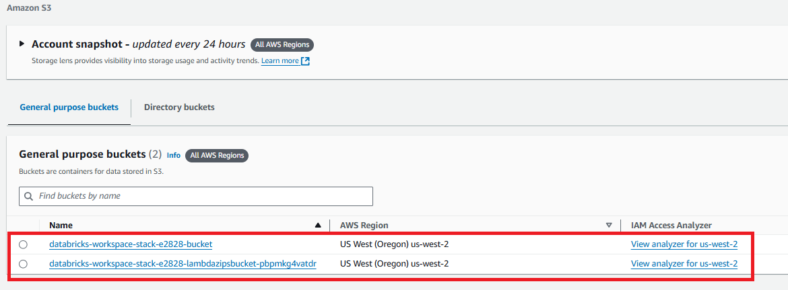

# AWS Setup for Databricks

In this section, we explain the integration between Databricks and AWS resources, focusing on the use of EC2 instances for compute power and S3 for data storage.

When you create a cluster in Databricks, the resources are provisioned from AWS, specifically **EC2 instances** for computing. Although Databricks abstracts the underlying AWS configuration, the actual resources are still managed and utilized in the AWS cloud environment.

### Key Components of AWS Utilized by Databricks

1. **EC2 Instances**:
   - When you launch a Databricks cluster, EC2 instances are provisioned to handle the compute resources required by the notebooks and jobs running on the cluster.
   - Databricks provides different cluster types and instance sizes that correspond to specific EC2 instance types, which are used to meet the performance requirements for different tasks.

2. **S3 Storage**:
   - All the data you work with in Databricks is stored in the **Unity Catalog**, which persists on **Amazon S3**. This includes the data you read, process, and write within your notebooks.
   - Even though Databricks manages the catalog, all persistent data is stored in S3, ensuring scalability and durability.
   
3. **Databricks Abstraction**:
   - While Databricks abstracts the detailed configurations and management of AWS services, the resources themselves are still provided and used by AWS. This includes things like provisioning EC2 instances, managing IAM roles for access control, and storing data in S3.

### How Databricks Uses AWS Resources

- **Cluster Creation**: When you create a cluster in Databricks, the platform automatically provisions the necessary EC2 instances to run your tasks.
- **Data Storage**: When you load or save data in Databricks, it is stored in S3, even if you are interacting with it through the Databricks interface. This ensures that the data is durable and can be accessed across sessions.

### Where to Find AWS Resources in Use

1. **EC2 Instances**:
   - Navigate to the AWS **EC2 Console**.
   - Look for the EC2 instances associated with Databricks clusters. These will typically be automatically created based on the cluster configuration you selected in Databricks.
   
   

2. **S3 Storage**:
   - Open the AWS **S3 Console**.
   - Search for the S3 bucket(s) associated with your Databricks workspace. These will store the Unity Catalog and other files used in your Databricks environment.

   

3. **IAM Roles**:
   - Access the **IAM Console** in AWS to see the roles and permissions assigned to Databricks. Databricks uses these roles to interact with other AWS services like S3 and EC2.

     

By utilizing EC2 instances for computation and S3 for storage, Databricks leverages the power of AWS to deliver a seamless, cloud-based analytics platform. While Databricks abstracts the details of the underlying infrastructure, AWS resources are actively being used to power your workloads and store your data. 
